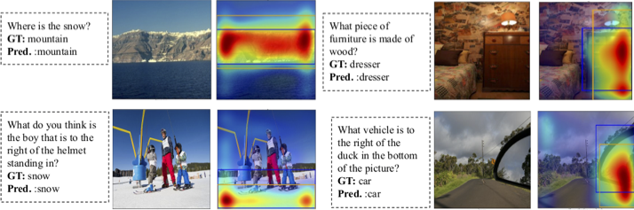

# Weakly Supervised Grounding for VQA in Vision-Language Transformers [ECCV 2022]

[Aisha Urooj Khan](https://aishaurooj.wixsite.com/aishaurooj), [Hilde Kuehne](https://hildekuehne.github.io/), [Chuang Gan](https://people.csail.mit.edu/ganchuang/), [Niels Da Vitoria Lobo](https://www.crcv.ucf.edu/person/niels-lobo/), [Mubarak Shah](https://www.crcv.ucf.edu/person/mubarak-shah/)

[`Website`]() | [`arXiv`]() | [`BibTeX`](#citation)

Official Pytorch implementation and pre-trained models for Weakly Supervised Grounding for VQA in Vision-Language Transformers (coming soon).

## Abstract
Transformers for visual-language representation learning have been getting a lot of interest and shown tremendous performance on visual question answering (VQA) and grounding. But most systems that show good performance of those tasks still rely on pre-trained object detectors during training, which limits their applicability to the object classes available for those detectors. 
To mitigate this limitation, the following paper focuses on the problem of weakly supervised grounding in context of visual question answering in transformers.  The approach leverages capsules by grouping each visual token in the visual encoder and uses activations from language self-attention layers as a text-guided selection module to mask those capsules before they are forwarded to the next layer. 
We evaluate our approach on the challenging GQA as well as VQA-HAT dataset for VQA grounding.
Our experiments show that: while removing the information of masked objects from standard transformer architectures leads to a significant drop in performance, the integration of capsules significantly improves the grounding ability of such systems and provides new state-of-the-art results compared to other approaches in the field.

<p align="center">

</p>

##### <p align="center">(a) Proposed Architecture, (b) Proposed Capsule Encoding layer, (c) Proposed Capsule Layer </p>

### Qualitative Results


### Code
This code is built upon code base of [LXMERT](https://github.com/airsplay/lxmert). Thanks to [Hao Tan](https://scholar.google.com/citations?user=OV1Y3FUAAAAJ&hl=en) for providing excellent code for their model.

#### Datasets
for pretraining, we used MSCOCO, VG for image-captions pairs and Viz7W, VQA v2.0, GQA for question-image pairs. We used instructions provided by [LXMERT](https://github.com/airsplay/lxmert) to prepare the data except a few changes.
1. We removed GQA validation set from pretraining data as we use it for grounding evaluation. 
2. We validate our pretraining on mscoco-minival split.

#### Pretraining 
To pretrain the backbone, use the following command:

```
bash run/pretrain_2stage_fulldata_no_init_16_caps.bash
```

#### Finetuning on downstream tasks

##### GQA
See ``` run/gqa_finetune_caps.bash ``` for finetuning on GQA dataset. 

##### VQA-HAT
Finetuning on VQA-HAT is similar to how we finetune the model on GQA. I will keep adding more concrete details in next few days.

### Citation
If this work is useful for your research, please cite our paper.

```bibtex
@inproceedings{Khan2022WeaklySG,
  title={Weakly Supervised Grounding for VQA in Vision-Language Transformers},
  author={Aisha Urooj Khan and Hilde Kuehne and Chuang Gan and Niels da Vitoria Lobo and Mubarak Shah},
  year={2022}
}
```

### Questions?
Please contact 'aishaurooj@gmail.com'


